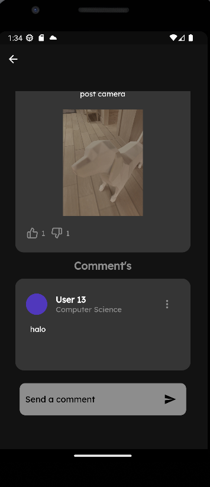
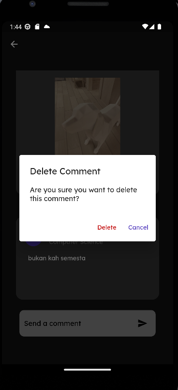

# &#x1F680; capstone_project

[](https://flutter.dev/docs)
[](https://flutter.dev/)
[](https://dart.dev/guides)


Developer:
- Arvin
- Carlene 
- Daffa

## &#x1F4DD; Pembagian Tugas

- Arvin : Authentication (Login, Signup), Frontend Improvements
- Carlene : Comment (Post, Update, Delete), Like (Post), Profile (Get & Edit)
- Daffa : Home (Get), Create Post (Post, Delete, Update)

### 🌲 Project Tree
```tree
├─ android/
├─ assets/
│  ├─ images/
├─ lib/
│  ├─ core/
│  │  ├─ bases/
│  │  ├─ client/
│  │  ├─ constant/
│  │  ├─ environments/
│  │  ├─ errors/
│  │  ├─ extensions/
│  │  ├─ theme/
│  ├─ features/
│  │  ├─ authentication/
│  │  ├─ create_post/
│  │  ├─ homepage/
│  │  ├─ main/
│  │  ├─ onboarding/
│  │  ├─ post_detail/
│  ├─ services/
│  ├─ app.dart
│  ├─ main.dart
├─ pubspec.lock
├─ pubspec.yaml
├─ .metadata
├─ README.md
├─ .gitignore
```

## &#x1F3E0; HomePage


## Create Post


## Edit Post


## &#x1F50D; Post Detail Page


## &#x1F4AC; Post Comment



## &#x2699; Comment Options


## &#x270F; Comment Edit


## &#x2716; Comment Delete



## &#x2764; Like Post

